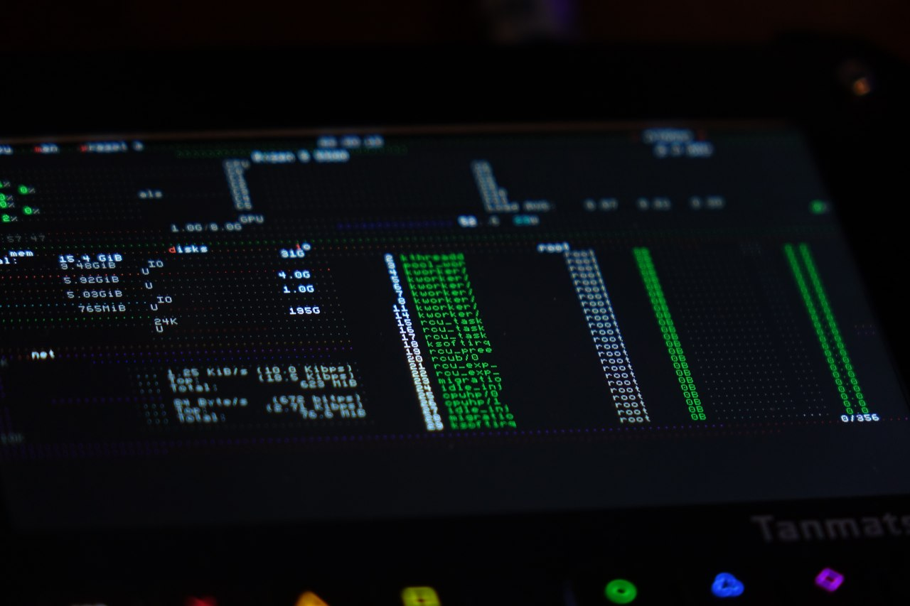
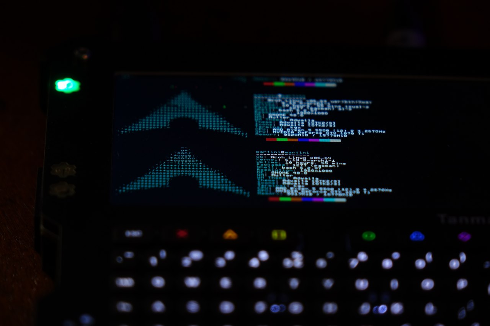

# Terminal emulator

A terminal emulator using the PAX graphics library

Supports basic ANSII escape sequences. Originally made for the Tanmatsu.

## License

Copyright © 2025 Kevin Witteveen (MartiniMarter)

The contents of this repository are made available under the terms of the [MIT license](LICENSE).
